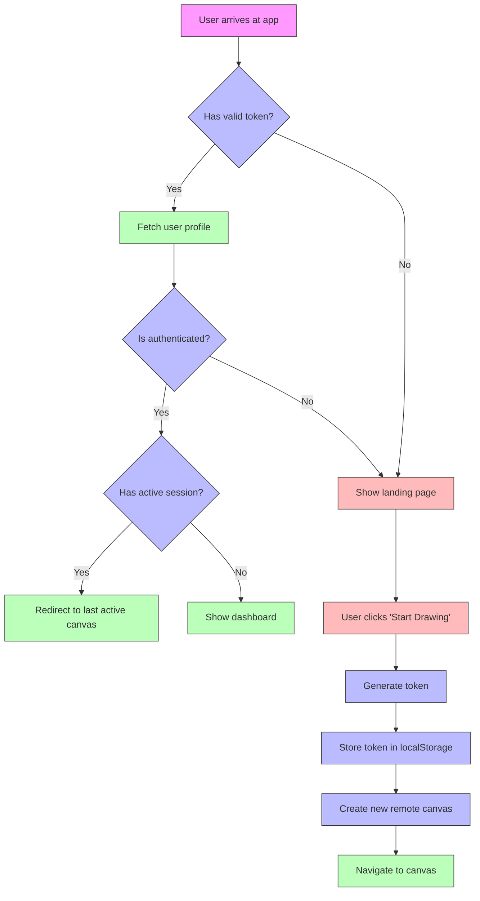
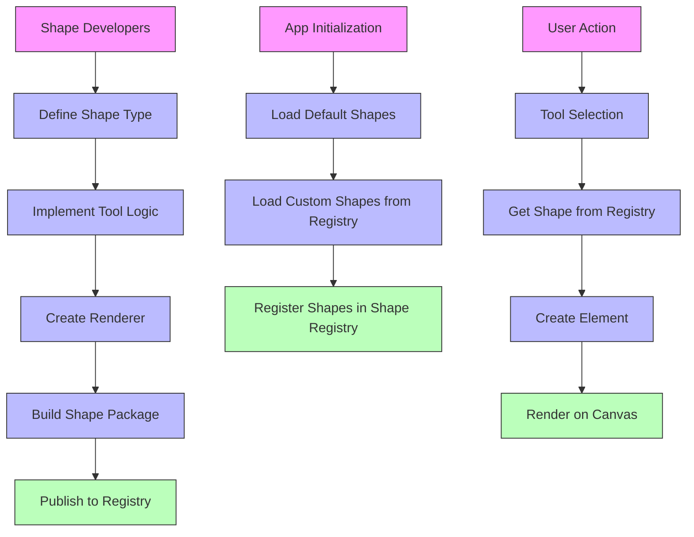

# Frontend Flow and Shape Extension Architecture Plan

## Overview

This plan defines:
1. Frontend authentication and navigation flow
2. Shape extension architecture for future extensibility

## Current State

### Authentication Flow
- Current: Simple login/signup with API calls
- No token validation from local storage
- No session persistence logic

### Shape System
- Current: Fixed set of shapes (rectangle, ellipse, diamond, arrow, line, freedraw, text, image)
- Hardcoded type definitions in `packages/common/src/types/element.ts`
- Tools implemented as separate files in `apps/dripl-app/utils/tools/`
- Centralized switch-case in `useDrawingTools` hook

## 1. Frontend Authentication and Navigation Flow

### Architecture Diagram

### Implementation Steps

1. **Token Validation System**
   - Create token validation middleware
   - Add token storage and retrieval methods
   - Implement token expiration check

2. **Session Management**
   - Track active canvas session
   - Store session metadata in localStorage
   - Implement session recovery logic

3. **Navigation Logic**
   - Update `AuthContext` to handle token validation
   - Create navigation guard component
   - Update dashboard to track last active canvas

4. **Landing Page Integration**
   - Add "Start Drawing" button with token generation
   - Implement remote canvas creation flow
   - Handle token storage and redirection

## 2. Shape Extension Architecture

### Design Principles

- **Pluggable**: Shapes should be installable as modules
- **Type-Safe**: Full TypeScript support for extensions
- **Dynamic Loading**: Shapes can be registered at runtime
- **Backward Compatible**: Existing shapes continue to work
- **Extensible API**: Clear interfaces for shape developers

### Architecture Diagram

### Implementation Steps

1. **Shape Type System**
   - Create extensible type definitions
   - Implement shape interface with base properties
   - Add support for custom properties

2. **Shape Registry**
   - Create shape registry singleton
   - Add registration and lookup methods
   - Implement metadata storage

3. **Tool Architecture**
   - Define tool interface with lifecycle methods
   - Create tool factory system
   - Implement dynamic tool loading

4. **Renderer System**
   - Create shape renderer interface
   - Implement Rough.js integration for default shapes
   - Add support for custom renderers

5. **Properties Panel**
   - Create dynamic properties component
   - Implement property type system
   - Add support for custom property editors

6. **Canvas Integration**
   - Update canvas renderer to use registry
   - Modify useDrawingTools hook to use dynamic tools
   - Update properties panel to be extensible

## Files to Modify

### Frontend Flow
- `apps/dripl-app/app/context/AuthContext.tsx` - Add token validation and session management
- `apps/dripl-app/app/page.tsx` - Update landing page with "Start Drawing" button
- `apps/dripl-app/app/dashboard/page.tsx` - Add session tracking
- `apps/dripl-app/lib/api/client.ts` - Add token handling methods

### Shape System
- `packages/common/src/types/element.ts` - Refactor type definitions for extensibility
- `packages/common/src/constants.ts` - Update shape constants
- `apps/dripl-app/hooks/useDrawingTools.ts` - Modify to use shape registry
- `apps/dripl-app/utils/tools/` - Create base classes for tools
- `apps/dripl-app/components/canvas/PropertiesPanel.tsx` - Make properties panel dynamic
- `packages/element/src/rough-renderer.ts` - Add renderer interface

## Testing Strategy

1. **Token Flow Tests**
   - Test token generation and storage
   - Verify token validation logic
   - Test session recovery

2. **Navigation Tests**
   - Test unauthenticated user flow (token → canvas)
   - Test authenticated user flow (dashboard → canvas)
   - Test session persistence

3. **Shape Extension Tests**
   - Test shape registration
   - Verify custom shape rendering
   - Test dynamic tool loading

4. **Integration Tests**
   - Test canvas interaction with custom shapes
   - Verify properties panel for custom shapes
   - Test collaboration with custom shapes

## Timeline

### Phase 1: Frontend Flow (1 week)
- Token validation system
- Session management
- Navigation logic
- Landing page integration

### Phase 2: Shape Architecture (2 weeks)
- Type system refactor
- Shape registry
- Tool architecture
- Renderer system
- Dynamic properties panel

### Phase 3: Integration (1 week)
- Canvas integration
- Testing
- Documentation

## Success Metrics

1. **Token Flow**: 100% of unauthenticated users can generate and use tokens
2. **Navigation**: 100% of authenticated users land on correct page
3. **Shape Extensibility**: Custom shapes can be created without modifying core code
4. **Performance**: No significant performance degradation
5. **Backward Compatibility**: All existing shapes continue to function

## Conclusion

This plan provides a comprehensive approach to:
1. Improve user experience with seamless authentication and navigation
2. Enable future extensibility with a pluggable shape system
3. Maintain compatibility with existing functionality
4. Provide clear guidelines for shape developers

The implementation will result in a more robust and scalable canvas application that supports both quick access for unauthenticated users and persistent sessions for authenticated users, while laying the foundation for extending the shape library with new diagram types.
